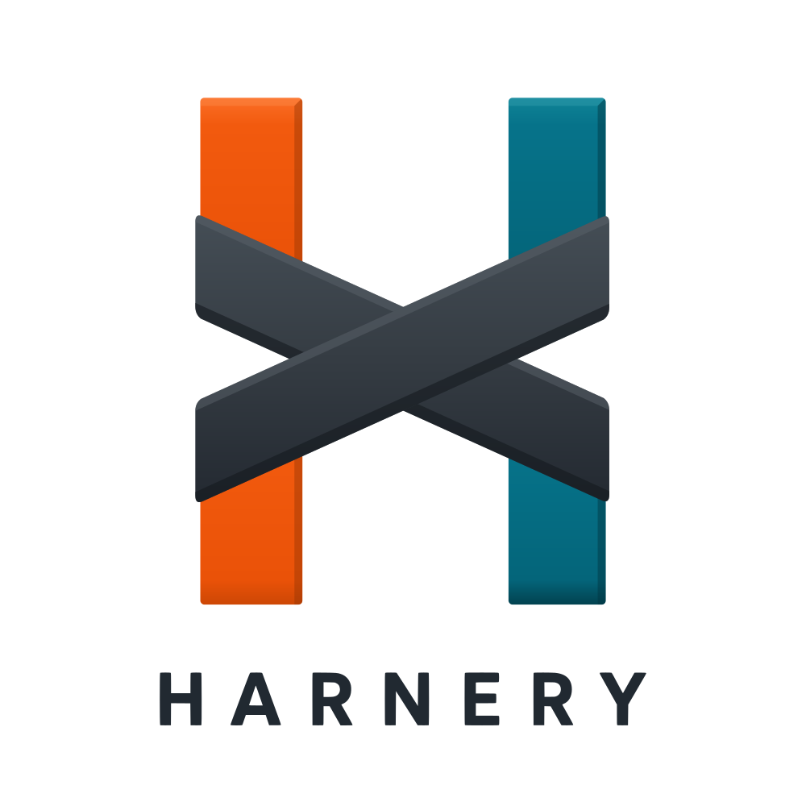

<p align="center">
  <picture>
    <source media="(prefers-color-scheme: dark)" srcset="assets/harnery-logo-reversed-transparent.svg">
    
  </picture>
</p>

# Harnery

> Multi-agent coordination for AI coding agents — Claude Code, Cursor, and Codex.

[](https://github.com/ryanjkelly/harnery/actions/workflows/ci.yml)
[](https://www.npmjs.com/package/harnery)
[](LICENSE)

> ⚠️ **Pre-1.0.** API surface is still settling. Pin a specific minor version (`harnery@^0.7.0`) and read the [CHANGELOG](CHANGELOG.md) before each upgrade.

## What it is

`harnery` keeps multiple AI coding agents from stepping on each other in a shared checkout. It was extracted from years of running several Claude Code / Cursor / Codex sessions at once against the same monorepo:

- **Multi-agent coordination:** per-agent heartbeats in `.harnery/active/`, claim-time and commit-time guards, the canonical event stream, councils, a decision docket, per-agent scratchpads, and harness adapters for Claude Code / Cursor / Codex.
- **Cross-machine presence:** sessions on every machine that shares a repo see each other, labeled by machine. Zero-config over the repo's own git remote (presence refs), with an optional live-socket upgrade via an end-to-end-encrypted relay — the public `relay.harnery.com`, or self-host with `harn relay serve` / the bundled Cloudflare Worker (`relay/worker/`). The relay sees only ciphertext in opaquely-named rooms.
- **Coordination-aware workflows:** `harn workflow run <script>` executes bounded, schema-gated multi-subagent workflow scripts — plain JS stages fanning out to headless harness-CLI subagents that are born coordination-registered (heartbeats, events, claim guards), with deterministic code deciding the routing between stages. An optional host-owned policy gates dispatch and declared external mutations with `ALLOW`, `ASK`, and `DENY`; CLI `ASK` requests park durably for an explicit approve/deny and same-run resume, while library callers remain fail-closed by default.
- **Durable work above attempts:** `harn work` preserves an objective across bounded workflow attempts, dependencies, approval parks, failures, and review. Reusable workflow code receives the exact work ID, title, objective, acceptance criteria, and attempt identity as frozen typed context. A retry also receives the prior run's bounded error and unresolved proof criteria, while retry authority and attempt ceilings remain unchanged. The manifest, proof, and append-only ledger bind the same context, and the one-shot reconciler reports the next explicit action without silently spawning, retrying, or accepting work.
- **Bounded goal supervision:** `harn supervisor` freezes a mission or existing root graph, specialist team, and safety limits, then runs scheduling cycles until reviewed mission success, human attention, no progress, or budget exhaustion. Its optional planner can create the first milestone, reassess accepted milestone proof, or recover a terminal graph using only a frozen workflow-template catalog. Plans can require independent bounded specialist review before ordinary approval or auto-apply authority, old generations remain immutable evidence, and all attempts still consume the goal budget. Use explicit foreground ticks or enroll goals in the optional heartbeat-backed background service.
- **Standalone web UI:** `harn web up` boots a local Next.js dashboard for the coord layer, councils, per-project state, and a local coding-agent status view (Claude Code / Codex / Cursor usage, backed by `harn devtools`). Ships with the git clone, not the npm package (see [Install](#install)).
- **Backup + sync:** `harn backup` snapshots `.harnery/` via [restic](https://restic.net/); `harn sync` keeps a curated subset live across machines via [rclone](https://rclone.org/) (Google Drive or any rclone remote).

The CLI also ships batteries: portable utility commands (`tokens`, `eml`, `env`, `grep` — parallel, ripgrep-accelerated monorepo search — `docs`, `browse`, `fetch`, `read`, `devtools`, and more) plus the library toolkit they're built from. Useful, cross-platform, dependency-light — and deliberately not the headline. Coordination is why harnery exists; the toolkit exists because the CLI needed it (see [Public surface tiers](#public-surface-tiers)).

## Install

```bash
curl -fsSL https://harnery.com/install.sh | bash
```

One line, no clone: it installs the `harn` CLI globally (npm preferred, Bun fallback), puts it on your `PATH`, and verifies it. Or drive your package manager directly — `npm install -g harnery` / `bun add -g harnery` (or `npm install harnery` for a project dep). Then wire a project:

```bash
harn init     # creates .harnery/ + registers the harness hooks
harn doctor   # optional: one-time runtime + dependency check
```

> **From a git clone?** Cloning for the `web/` dashboard or to contribute? `./scripts/setup.sh` does the clone setup in one shot: installs deps, builds `dist/` on a Bun-free host, runs `harn init`, and links the bins onto your `PATH`.

> **npm gives you the engine + CLI.** The `web/` dashboard and the `docs/` site live in the git repo, not the npm package (which is the CLI + coord engine: `bin`, `dist`, `src`, `schemas`). To run the dashboard, `git clone` the repo, `bun install`, and `harn web up` from there, pointing it at your project with `--coord-root <dir>` (or just run it from inside the project). `harn web up` prints these exact steps if you invoke it without the clone present.

## Uninstall

Two layers. **Unwire a project** (keeps `.harnery/` history by default; on a terminal it asks before deleting it):

```bash
harn deinit                 # unwire the harness hooks
harn deinit --purge-state   # also delete .harnery/ (destructive)
```

**Remove the CLI** with the hosted one-liner (`npm rm -g harnery` / `bun remove -g harnery` work too):

```bash
curl -fsSL https://harnery.com/uninstall.sh | bash
```

From a git clone, `./scripts/teardown.sh` is the mirror of `./scripts/setup.sh`: it runs `harn deinit`, removes the `PATH` symlinks, and — on a terminal — asks whether to also delete this project's `.harnery/` history and the clone itself. Both default to no; pre-answer with `--purge-state` and `--remove-clone` for unattended runs.

## Use as a CLI library

Project-specific CLIs compose Harnery's command tree and add their own commands on top:

```ts
// mycli/src/program.ts
import { createHarneryProgram } from 'harnery/commander';
import { deployCommand, dbCommand } from './commands';

const program = createHarneryProgram({
  binName: 'mycli',
  context: { projectName: 'my-monorepo' },
});

program.addCommand(deployCommand);
program.addCommand(dbCommand);

await program.parseAsync(process.argv);
```

`mycli agents status` then resolves to **the same code** as `harn agents status`, loaded as a library. See [examples/extending-with-commander.ts](examples/extending-with-commander.ts) for the full pattern.

### Public surface tiers

The exports map draws the line between what harnery *is* and what it *ships with*:

- **Product tier** — `harnery`, `harnery/commander`, `harnery/core/*`: the coordination layer and CLI composition. This is the API to build against, and the reason to install harnery.
- **Toolkit tier** — every `harnery/lib/*` subpath (`http`, `cookies`, `format`, `readability`, `browser`, `machine`, …): the supporting utilities harnery's own CLI is built from, exposed for embedding hosts that want to lean on them. Supported, but secondary: it can evolve faster than the product tier, and it isn't a reason to adopt harnery on its own.

The boundary is enforced, not aspirational: CI verifies that no `harnery/lib/*` export imports the coordination core, directly or transitively (`scripts/check-layering.ts`), so pulling a toolkit module never drags in coordination state. Details: [Embedding + surface tiers](https://harnery.com/concepts/embedding/).

## Documentation

Full docs at **[harnery.com](https://harnery.com)**:

- [Getting started](https://harnery.com/getting-started/install)
- [CLI reference](https://harnery.com/cli/)
- [Concepts](https://harnery.com/concepts/coord-layer)
- [Configuration schema](https://harnery.com/reference/config-schema)

## Contributing

See [CONTRIBUTING.md](CONTRIBUTING.md). Bug reports and feature requests via [GitHub Issues](https://github.com/ryanjkelly/harnery/issues).

## License

[MIT](LICENSE) © Ryan Kelly
